# Çınar Coffee Shop ASP.NET Web Application Project

## Introduction 

A Coffee Shop web application developed to make it easy for users to make their coffee orders
online. It gives users the opportunity to choose the coffee/food item of their choice and seat then make 
orders based on the items selected. It is an ASP.NET MVC architecture based application. 

## Prerequisites

Visual Studio installed with ASP.NET, C# and MySQL for visual studio should be good for a start.

## Project Screenshots

### Login Page 

Users can login as customers or admin using this page

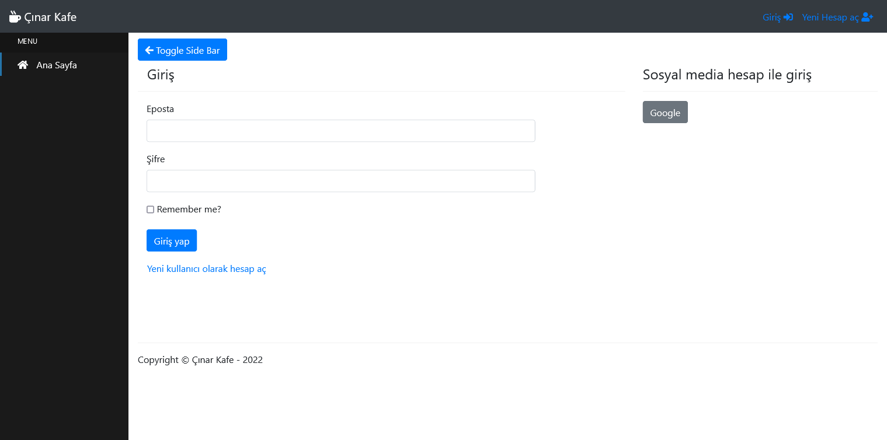

### Registeration Page 

Users can create a new account using this page

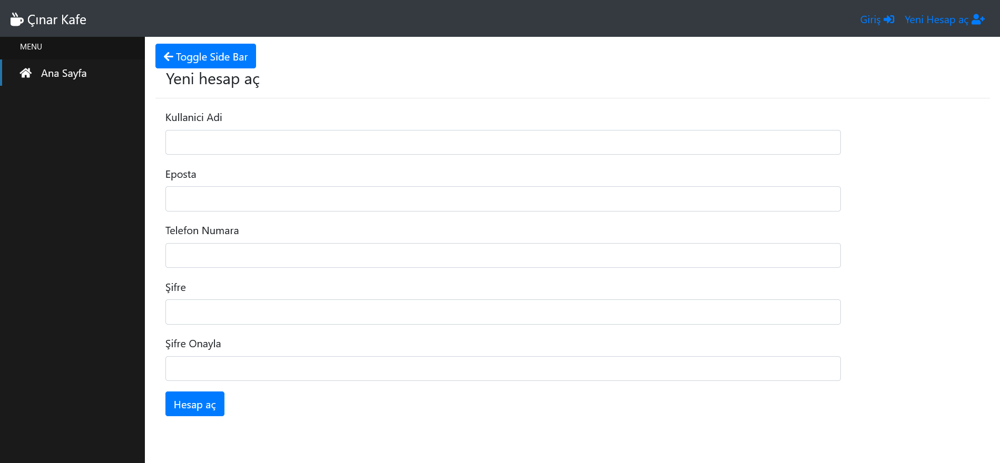

### Home Page - Not Authenticated

This page shows a grid view of all the products in-stock 

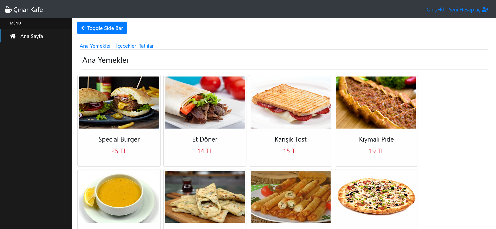

## Admin Site

These pages can only be accessed by an admin user

### Dashboard - Data Grid View
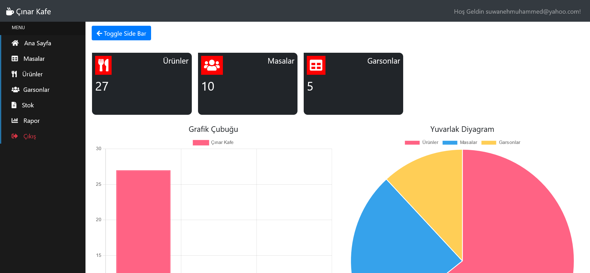

### Dashboard - Data Graph View
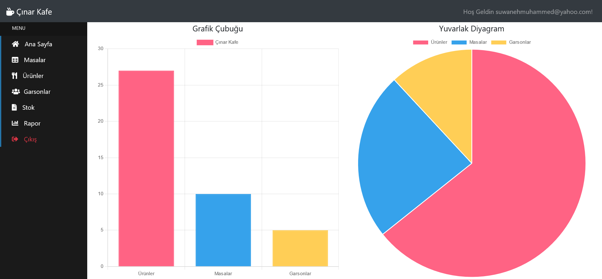

### Shop Tables List View
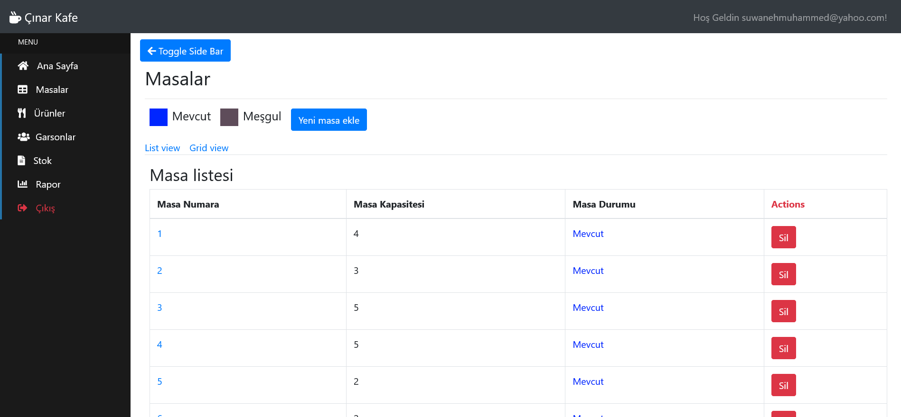

### Shop Tables Grid View
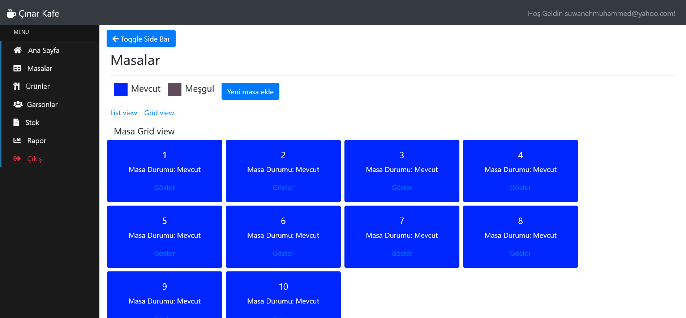

### New Shop Table
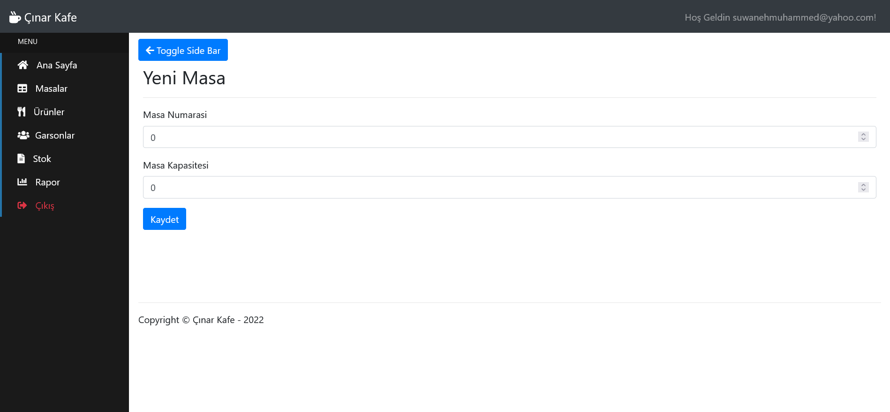

### Shop Items List view
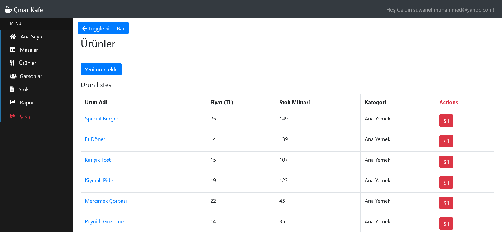

### New Shop Item
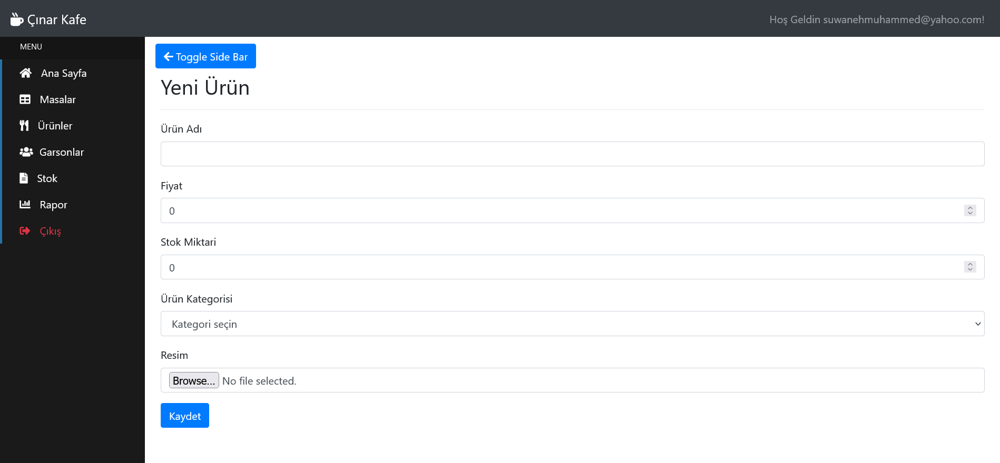

### Waiters List View
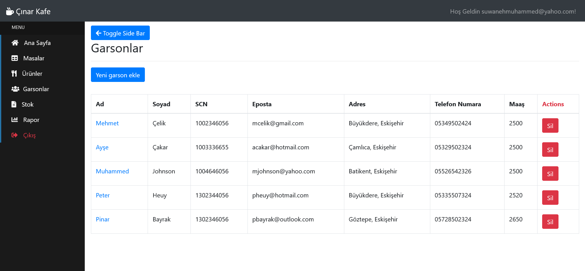

### New Waiter
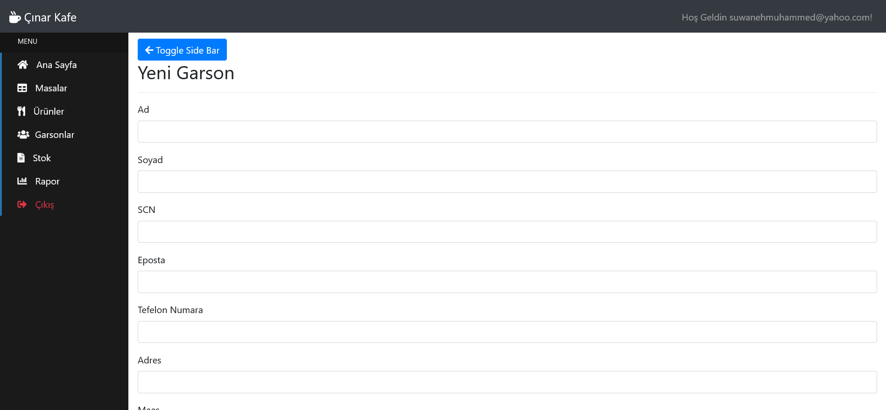

### Stok List View

## Customer Site 

### Shop Items - Main Food Items
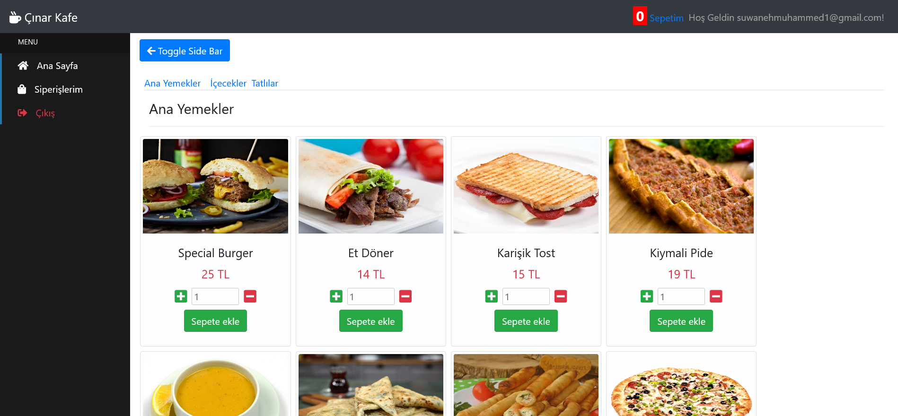

### Shop Items - Drinks
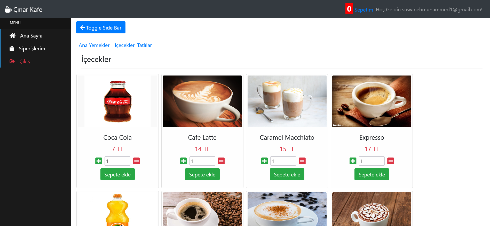

### My Orders Page
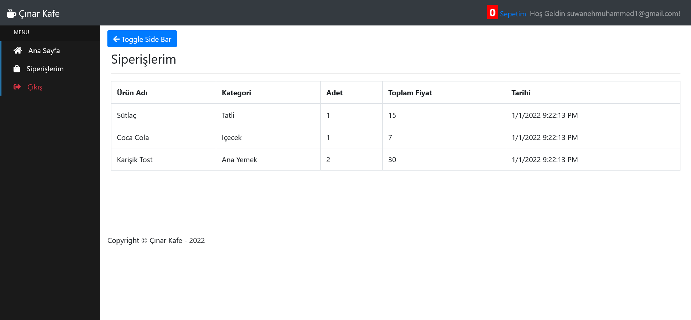

### Cart List View
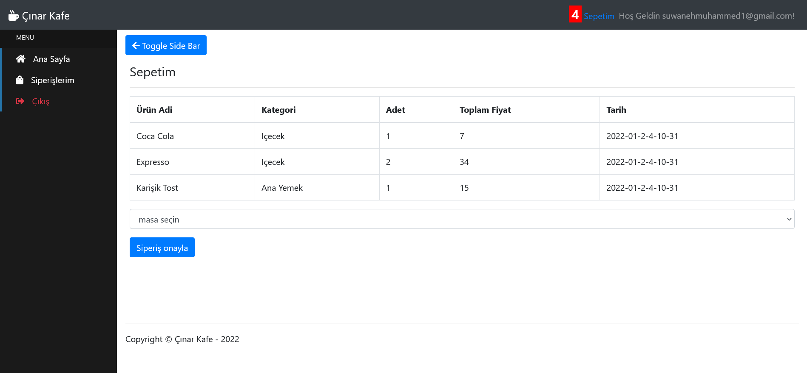

Below are technologies used during the development and production process

## Techologies 

### Front-end
- HTML5
- CSS3
- JavaScript ES5, ES6
- JQuery 3
- JQuery.Bootbox
- Fontawesome
- Toastr

### Back-end 

- C#
- .Net Framework
- ASP.NET MVC 5
- Entity Framework 6
- Automapper
- Dapper Micro ORM
- WebApi (REST APIs)
- OAuth [Google Authentications & Authorization]
- SSL Certificate

### Database & Server
- Microsoft SQL Server
- Microsoft Azure

### Design
- ADOBE XD [UI&UX]
- Draw.IO [ER&UMLs]
- Visual Studio [Development Environment]

## Contributors

- Muhammed Suwaneh (UI/UX, Back-end, Front-end, Database Management & Queries)
- Ipek Birinci (Report Writing, Project Management)
- Ayşe Güç (Report Writing, Project Management)
- Zorbey Çelik (Report, Database Management & Queries)